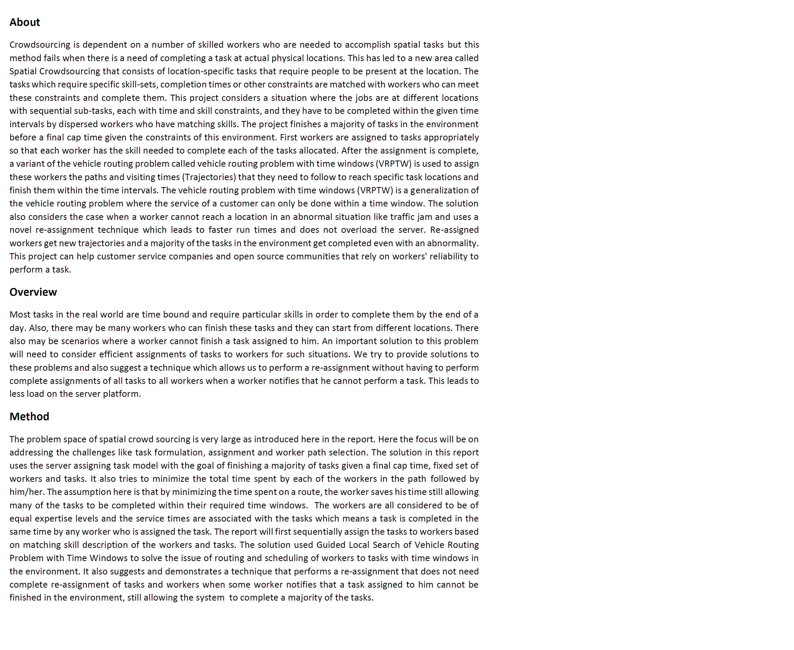
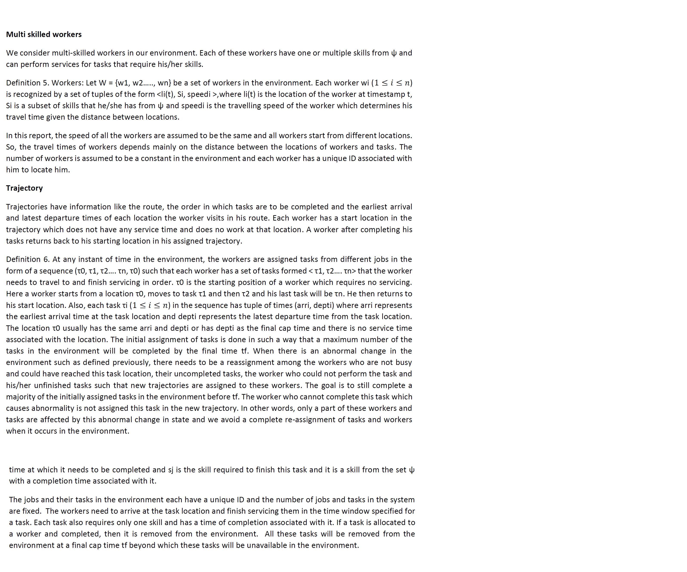
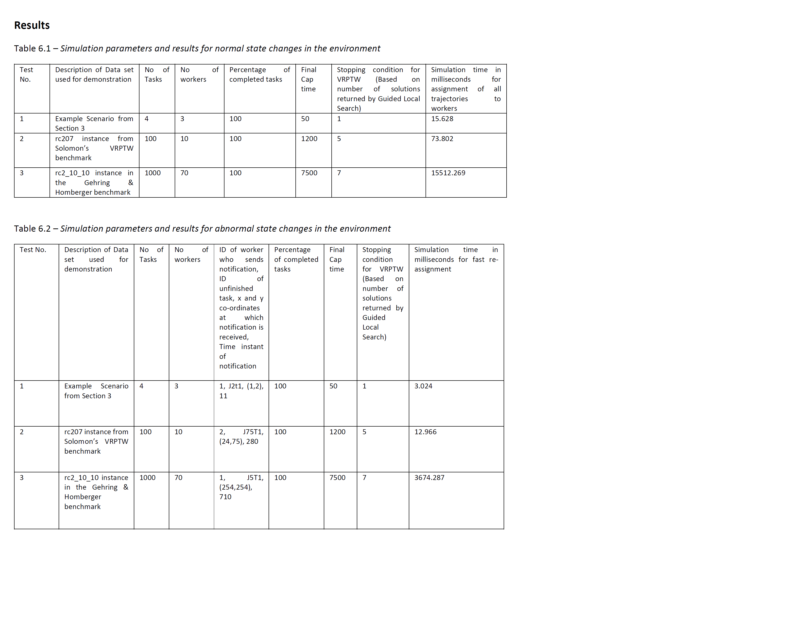
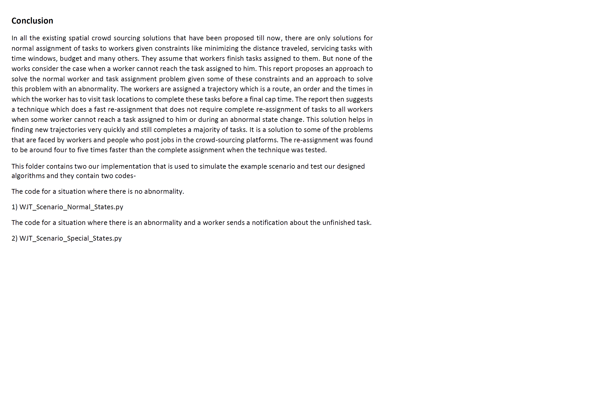

##

##

##

##

##

##

##

##

##

This folder contains two our implementation that is used to simulate the example scenario and test our designed algorithms and they contain two codes-

The code for a situation where there is no abnormality.

1) WJT_Scenario_Normal_States

The code for a situation where there is an abnormality and a worker sends a notification about the unfinished task.

2) WJT_Scenario_Special_States
